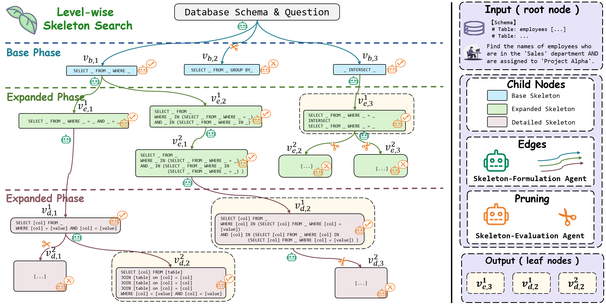

# LEAF-SQL: Level-wise Exploration with Adaptive Fine-graining for Text-to-SQL Skeleton Prediction

[](https://opensource.org/licenses/MIT)

This repository contains the official code and resources for the paper: "LEAF-SQL: Level-wise Exploration with Adaptive Fine-graining for Text-to-SQL Skeleton Prediction".

## 📖Introduction

LEAF-SQL is a framework that treats Text-to-SQL as a tree search problem, exploring multiple skeleton candidates with diverse structures and granularities to improve the final query's accuracy.

<div align="center">
  
</div>

## 🚀 Quick Start

For a quick demonstration of the LEAF-SQL method, you can run the example script. Please note that this is a simplified version and does not represent the full functionality.

```bash
python example.py
```


## 🏁 Standard Usage

Follow these steps for the complete setup and execution.

### Step 1: Install Dependencies

Install all the required packages from `requirements.txt`.
```base
pip install -r requirements.txt
```

### Step 2: Download Models and Dataset

Download the necessary models from ModelScope.
```base
# Download the SkeEva model
modelscope download --model mrtanzhao/SkeEva --local_dir ./models/skeeva

# Download the SkeFor model
modelscope download --model Qwen/Qwen3-14B --local_dir ./models/skefor
```

Download the BIRD dataset from the official website: https://bird-bench.github.io/

### Step 3: Configure Settings

Modify the configuration file `./config/config.yaml` to match your environment settings (e.g., file paths, api_key).

## Step 4: Launch API Servers

Start the two model services in separate terminal sessions. Adjust the parameters (like CUDA_VISIBLE_DEVICES, tensor-parallel-size, etc.) according to your hardware specifications.

```base
CUDA_VISIBLE_DEVICES=0,1 python -m vllm.entrypoints.openai.api_server \
    --model ./models/skefor \
    --served-model-name skefor \
    --port 8001 \
    --tensor-parallel-size 2 \
    --max-num-seqs 32 \
    --max-num-batched-tokens 1024
```

```base
CUDA_VISIBLE_DEVICES=2,3 python -m vllm.entrypoints.openai.api_server \
    --model ./models/skeeva \
    --served-model-name skeeva \
    --port 8002 \
    --tensor-parallel-size 2 \
    --max-num-seqs 32 \
    --max-num-batched-tokens 1024
```

### Step 5: Run the Main Program

Once the services are running, execute the main script.
```base
python main.py
```

## 🌈 Contact Us
This project welcomes contributions and suggestions 👍.

If you find a bug, encounter a problem, or have a suggestion for LEAF-SQL, please submit an issue or reach out via email(tanzhao325@gmail.com).

## 📝 Citation
If you find our work useful or inspiring, please consider citing the repository:
```bibtex
@misc{leaf-sql-github,
  author       = {Zhao Tan and
                  Xiping Liu and
                  Qing Shu and
                  Qizhi Wan and
                  Dexi Liu and
                  Changxuan Wan},
  title        = {LEAF-SQL: Level-wise Exploration with Adaptive Fine-graining for Text-to-SQL Skeleton Prediction},
  year         = {2025},
  publisher    = {GitHub},
  journal      = {GitHub repository},
  howpublished = {https://github.com/Atlamtiz/LEAF-SQL}
}
```